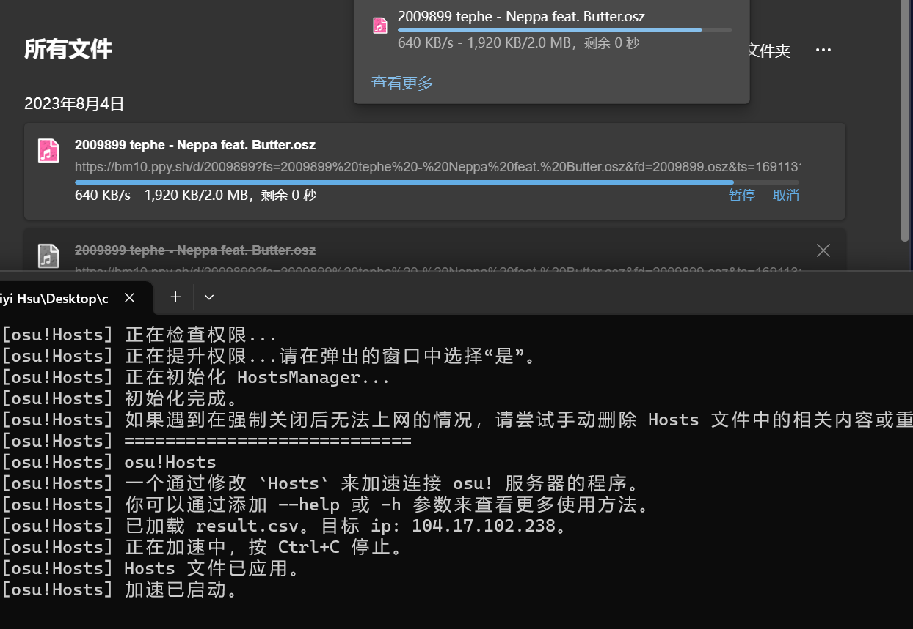

# osu-Hosts
一个使用 Hosts 来加速 osu 及其服务的程序

# 效果

  
  
在官网也能愉快下图了（差点还没截图就下完了）

# 下载
- [Windows-gitee](https://gitee.com/x1052/osu-Hosts/releases/download/v1.0.2/osu!Hosts-win-x64.zip)(国内用户建议下这个)
- [Windows-github](https://github.com/Cai1Hsu/osu-Hosts/releases/latest/download/osu.Hosts-win-x64.zip)

- <a href="javascript:void(alert('其实我还没编译，但你点了这个按钮，一定可以自己编译。'));">Linux-github</a>

# CI ?
~~CI又不能给我涨200pp~~
# License
[MIT License](https://opensource.org/licenses/MIT)